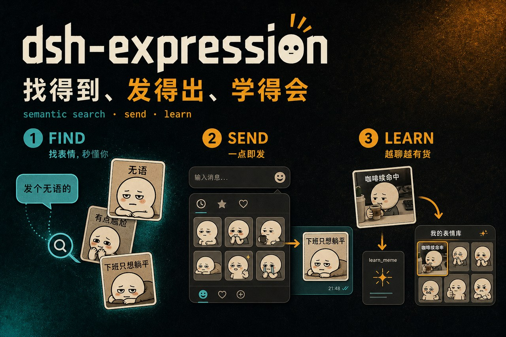
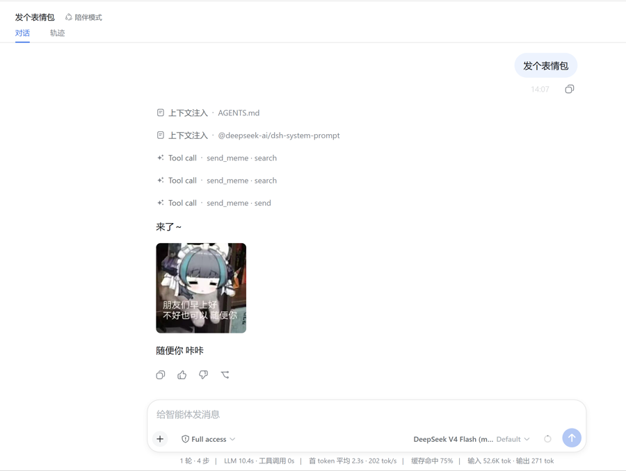
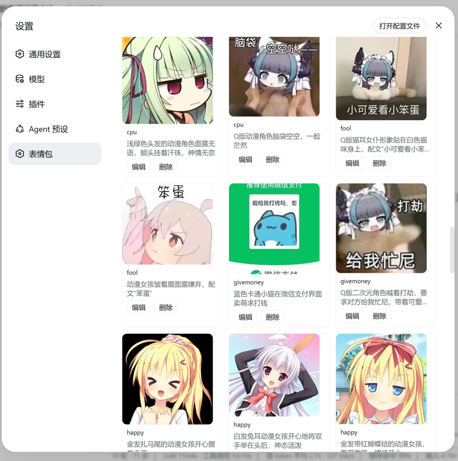
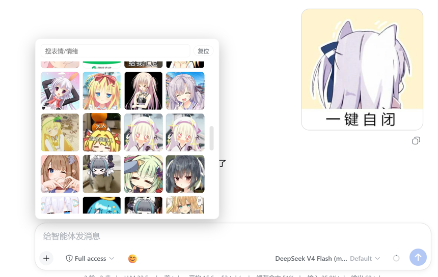

<p align="center">
  
</p>

<p align="center">
  <strong>表情包插件 dsh-expression</strong> — 找得到、发得出
</p>

<p align="center">
  <a href="./LICENSE"></a>
  <a href="https://github.com/topics/dsh-plugin"></a>
  
  
  
</p>

---

聊天 Agent 斗图最容易翻车的三件事：

- 手写假路径  
- 乱发不贴题的图  
- 搜不到就硬发  

**dsh-expression** 是 DeepSeek Harness 的表情包插件：直接读你现成的表情包库，语义检索后只发**真实存在的文件**。  
数据来自 [selfloom](https://github.com/yyh-001/selfloom)（单用户陪伴 agent）的表情包库——**零迁移、开箱即搜**。发送走 [`dsh-companion`](https://github.com/yyh-001/dsh-companion) 的 QQ 通道（`companionQq` 服务）；没有 QQ 通道就不挂工具，绝不给模型一个发不出去的空工具。

**配合陪伴插件 dsh-companion 的效果**：不需要任何插件 API，模型会结合会话上下文主动判断情绪、恰到好处地发一张贴题的表情包——情绪到了直接发，实现「陪伴式斗图」。

想换一套聊天搭子人设？另装 **[dsh-companion](https://github.com/yyh-001/dsh-companion)**（人设 + Hermes 记忆 + QQ 通道）——两者独立、可选搭配，本仓不含人设。

交流 / 反馈：**QQ 群 [993579665](https://qm.qq.com/q/7AD2g70HqS)**（[点击加入](https://qm.qq.com/q/7AD2g70HqS)）

---

## 安装

已发布到 **npm**（`dsh-expression@0.1.0`），一行装进任意 DSH profile（如 `~/.dsh/profiles/web/`）：

```bash
dsh plugin --profile web add dsh-expression
# 等价于:
pnpm add dsh-expression
```

或从 GitHub / 本地直接装：

```bash
pnpm add github:yyh-001/dsh-expression   # 或
pnpm add file:/path/to/dsh-expression
```

## 配置

默认直接内置图库（`memes/official-001`），开箱即用，绝大多数情况**无需任何配置**。若你要指向别的图库，在 cordis.yml 里加一行覆盖 `memeRoot`：

```yaml
- id: selfloom-expression
  name: dsh-expression
  config:
    memeRoot: /your/path/to/meme-pack   # 可选；默认内置 memes/official-001
```

装完后新开一个会话，模型就会看到 `send_meme`。

## 装完即用

```text
用户: 发个无语的表情包
模型: 调 send_meme query=「无语」→ 拿到真实文件 → 发图并简短接话
```

也可以在输入框左侧点 **😊** 直接选图一键发出，无需让模型代劳：

```bash
# 模型视角自检图库:
# 「send_meme 搜一下'下班'有什么」
```

实际效果（会话里让模型发表情包，search 选图 → 发出）：

<p align="center">
  
</p>

## 界面

设置页「表情包」面板：浏览 / 编辑 / 删除图库，也可直接上传新图。

<p align="center">
  
</p>

输入框 😊 一键发表情包：点开面板 → 搜索 / 浏览缩略图 → 点一张直接发出（点外部自动收起）。

<p align="center">
  
</p>

## 它做什么

| 能力 | 说明 |
|------|------|
| **语义搜图** | 口语 query → bigram Dice 相似度排序；口语词同义词兜底（「摸鱼」→ 下班/工作分类） |
| **真实路径发出** | 索引内相对路径解析后禁止逃出图库根，只发 `MemesStore` 返回的真实文件 |
| **输入框一键发图** | 会话输入框左侧 😊 按钮 → 悬浮面板选图 → 一点即发；点外部自动收起 |
| **情绪主动发图** | 工具描述鼓励"情绪到了直接发"；发完不啰嗦、不复述图 |
| **数据零迁移** | 直接读 selfloom 图库（`index.db` SQLite 只读 + `memes/<tag>/` 图片），无需任何导入步骤 |

## 日常命令（模型视角）

```text
send_meme query=「想下班」          # 语义检索 + 发送
send_meme tag=shy                  # 按分类发一张
send_meme query=「不存在的词」      # 无命中 → 返回图库分类清单，引导换词重试
```

数据根目录默认是随包内置的 `memes/official-001`；可用 `config.memeRoot` 覆盖到别处。

## 给模型的三条铁律

完整约定见 `send_meme` 工具描述。

1. 只用 `MemesStore` 返回的真实路径，不手写路径、不自己 `ls` 挑图  
2. 搜失败就回文字、列分类让用户换词，别硬发  
3. 发完保持简短，让图自己说话——不复述、不描述图的内容

## 图库来源

内置默认图库（`id: official-001`，名「官方表情包1号」）来自 **Astrbot mememanager 官方初始表情包**：

- 上游仓库：[anka-afk/astrbot-meme-pack-official-01](https://github.com/anka-afk/astrbot-meme-pack-official-01)（`main` 分支），维护者 **anka-afk**
- 构成：`index.db`（SQLite 索引，含每张 caption/关键词，供语义检索）+ `manifest.json`（分类说明 + 来源标注）+ `memes/<tag>/` 图片 + `previews/`
- 本仓库内置版本已删减 8 张不合适的图片（92 张），索引与磁盘保持一致
- ⚠️ 上游**未提供 LICENSE**：这套图缺乏显式的再分发许可。随插件打包作为个人默认库使用没问题；如需公开对外分发，请保留 manifest.json 中的上游来源标注。

## 接到你的 Agent

| 组件 | 说明 |
|------|------|
| **dsh-expression** | 本插件：`MemesStore`（检索）+ `send_meme`（发送） |
| **[dsh-companion](https://github.com/yyh-001/dsh-companion)** | 人设 + Hermes 记忆 + QQ 通道；提供 `companionQq` 服务供发图 |
| **图库** | 内置默认图库 `memes/official-001/`（可 `memeRoot` 覆盖），源自 [astrbot-meme-pack-official-01](https://github.com/anka-afk/astrbot-meme-pack-official-01) |

```text
dsh-expression/
  index.js        插件入口：memeRoot 配置 + companionQq 服务消费
  memes.js        MemesStore：SQLite 只读索引 + bigram Dice 检索 + 路径安全
  memes/
    official-001/   内置默认图库（index.db + manifest.json + memes/<tag>/）
  package.json    name / inject / peer deps
  README.md
  LICENSE
```

## 已知限制

- 管理操作（上传/删除/改元数据）未移植——图库维护仍走原 selfloom 控制台或直接操作目录；
- 发送目标是 QQ 通道的"最近聊天"（与 dsh-companion 的单目标 MVP 一致）；
- 检索算法与 selfloom 原版一致（bigram Dice），部分口语词的匹配质量取决于图库 caption。

## License

[MIT](./LICENSE)
